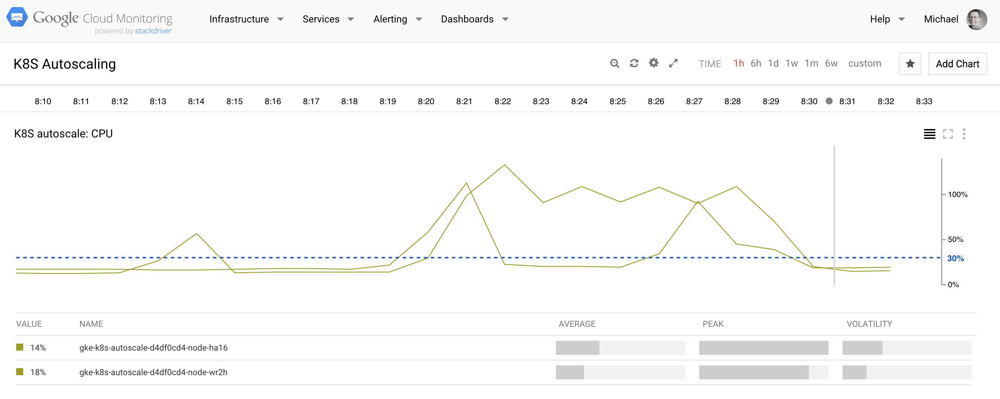

# Autoscaling

## Environment

I chose a GCP setup (via GCloud CLI):

    $ gcloud config set compute/zone europe-west1-d

    $ gcloud container clusters create k8s-autoscale --num-nodes 2 --machine-type g1-small
    Creating cluster k8s-autoscale...done.
    Created [https://container.googleapis.com/v1/projects/mh9-k8s/zones/europe-west1-d/clusters/k8s-autoscale].
    kubeconfig entry generated for k8s-autoscale.
    NAME           ZONE            MASTER_VERSION  MASTER_IP      MACHINE_TYPE  NUM_NODES  STATUS
    k8s-autoscale  europe-west1-d  1.1.2           104.155.48.64  g1-small      2          RUNNING
    $ gcloud compute instances list
    NAME                                 ZONE           MACHINE_TYPE PREEMPTIBLE INTERNAL_IP EXTERNAL_IP    STATUS
    gke-k8s-autoscale-2f81153f-node-4fi0 europe-west1-d g1-small                 10.240.0.3  146.148.18.185 RUNNING
    gke-k8s-autoscale-2f81153f-node-igvf europe-west1-d g1-small                 10.240.0.2  104.155.17.78  RUNNING

    $ gcloud container clusters delete k8s-autoscale

## Monitoring

To monitor the test I used [heapster](https://github.com/kubernetes/heapster) which comes pre-installed on GCP:

    $ kubectl get services --all-namespaces
    NAMESPACE     NAME                   CLUSTER_IP       EXTERNAL_IP   PORT(S)         SELECTOR           AGE
    default       kubernetes             10.239.240.1     <none>        443/TCP         <none>             16m
    kube-system   default-http-backend   10.239.242.22    nodes         80/TCP          k8s-app=glbc       16m
    kube-system   heapster               10.239.245.222   <none>        80/TCP          k8s-app=heapster   16m
    kube-system   kube-dns               10.239.240.10    <none>        53/UDP,53/TCP   k8s-app=kube-dns   16m
    kube-system   kube-ui                10.239.254.106   <none>        80/TCP          k8s-app=kube-ui    16m

    $ kubectl cluster-info
    Kubernetes master is running at https://146.148.9.97
    GLBCDefaultBackend is running at https://146.148.9.97/api/v1/proxy/namespaces/kube-system/services/default-http-backend
    Heapster is running at https://146.148.9.97/api/v1/proxy/namespaces/kube-system/services/heapster
    KubeDNS is running at https://146.148.9.97/api/v1/proxy/namespaces/kube-system/services/kube-dns
    KubeUI is running at https://146.148.9.97/api/v1/proxy/namespaces/kube-system/services/kube-ui

In order to visualize the data I'm using the native stackdriver-powered Google [Cloud Monitoring](https://app.google.stackdriver.com/) which needs to be enabled separately. Following the [instructions](https://github.com/kubernetes/heapster/blob/master/docs/google.md) I arrived at this:

## System Under Test

A simple CPU cycle burner. This is how is can be run locally with Docker:

    $ wget -O b.js -q https://gist.githubusercontent.com/mhausenblas/1bbd628a35ed5e58b8f2/raw/5e74ec7b4713374ce92516a0bb1011a5ef48541b/cpu-burner.js
    $ docker run -v "$PWD":/usr/src/app -w /usr/src/app node:4.2.2 node b.js

First, we create the RC and the service:

    $ kubectl create -f cpu-burner-server-svc.yaml
    $ kubectl create -f cpu-burner-server-rc.yaml

The service is now available via `$BASE_URL/service/kubernetes/api/v1/proxy/namespaces/default/services/burner-svc/` producing output such as:

    I burned 164136709 cycles

Now, let's [autoscale](http://kubernetes.io/v1.1/docs/user-guide/kubectl/kubectl_autoscale.html):

    $ kubectl autoscale rc burner --max=3 --cpu-percent=30

Above means: scale up to three replicas for a target avg. CPU utilization of 30%.

## Load Generator

For the load generator we're using a [bnorrin/docker-boom](https://hub.docker.com/r/bnorrin/docker-boom/), 
a containerized version of the popular [boom](https://github.com/tarekziade/boom) load tester.

First we need to figure where the CPU cycle burner server is available (within the cluster):

    $ kubectl get svc
    NAME         CLUSTER_IP      EXTERNAL_IP   PORT(S)    SELECTOR            AGE
    burner-svc   10.239.255.45   <none>        8002/TCP   app=burner-server   3m
    kubernetes   10.239.240.1    <none>        443/TCP    <none>              1h

In our case this is on `10.239.255.45`, and with that we set up the load generator RC (below means 10 concurrent users and 100 requests each):

    ...
    containers:
    - image: bnorrin/docker-boom
      name: boom
      command: ["/bin/sh","-c"]
      args: ["while true ; do boom http://10.239.255.45:8002/ -c 10 -n 100 ; sleep 1 ; done"]
    ...

And now we launch it:

    $ kubectl create -f load-gen-rc.yaml
