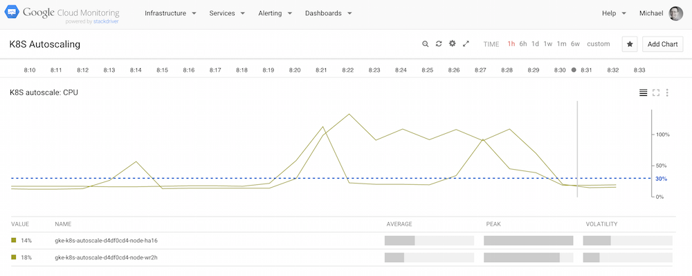

# Autoscaling

With the version 1.1 of Kubernetes a cool new feature called [Horizontal Pod Autoscaler](http://kubernetes.io/v1.1/docs/user-guide/horizontal-pod-autoscaler.html) 
or simply autoscaler has been introduced. It is implemented as a control loop, periodically querying the CPU utilization of pods under management of a certain RC. It takes the average of the CPU utilization and adjusts the replica count of the RC to match the desired target CPU utilization in the RC.
 
The underlying [autoscaling algorithm](http://kubernetes.io/v1.1/docs/design/horizontal-pod-autoscaler.html#autoscaling-algorithm) is as follows:

- The observation period of the autoscaler is controlled by `--horizontal-pod-autoscaler-sync-period` and defaults to 30 sec.
- The CPU utilization is the average CPU usage of a pod across the last minute divided by the CPU requested by the pod. 
- Currently, the CPU usage is taken directly from Heapster (see also below). In future, there will be an API on the master for this, see also PR <a href="https://github.com/kubernetes/kubernetes/pull/11951">11951</a>).

The target number of pods is calculated from the following formula:

    TargetNumOfPods = ceil(sum(CurrentPodsCPUUtilization) / Target)

Since starting/stopping pods usually introduces noise to the metric, after each action, the autoscaler should wait some time for reliable data. The scale conditions are:

- Scale-up can only happen if there was no rescaling within the last 3 minutes. 
- Scale-down will wait for 5 minutes from the last rescaling.

Note that any scaling will only be made if `avg(CurrentPodsConsumption)/Target` drops below 0.9 or increases above 1.1, that is, a 10% tolerance. This has the  benefit that if new user load appears the number of pods can grow rapidly and user requests are not rejected, while lowering the number of pods is not that urgent.
This strategy further avoids thrashing, that is, prevents rapid execution of conflicting decision if the load is not stable.

## Environment

To test the autoscale I chose a Google Cloud Platform (GCP) setup, using the [Google Cloud Shell](https://cloud.google.com/cloud-shell/docs/):

To ramp up the [Google Container Engine](https://cloud.google.com/container-engine/) (GKE) cluster I did:

    $ gcloud config set compute/zone europe-west1-d
    $ gcloud container clusters create k8s-autoscale --num-nodes 2 --machine-type g1-small
    Creating cluster k8s-autoscale...done.
    Created [https://container.googleapis.com/v1/projects/mh9-k8s/zones/europe-west1-d/clusters/k8s-autoscale].
    kubeconfig entry generated for k8s-autoscale.
    NAME           ZONE            MASTER_VERSION  MASTER_IP      MACHINE_TYPE  NUM_NODES  STATUS
    k8s-autoscale  europe-west1-d  1.1.2           104.155.48.64  g1-small      2          RUNNING
    $ gcloud compute instances list
    NAME                                 ZONE           MACHINE_TYPE PREEMPTIBLE INTERNAL_IP EXTERNAL_IP    STATUS
    gke-k8s-autoscale-2f81153f-node-4fi0 europe-west1-d g1-small                 10.240.0.3  146.148.18.185 RUNNING
    gke-k8s-autoscale-2f81153f-node-igvf europe-west1-d g1-small                 10.240.0.2  104.155.17.78  RUNNING

And after the experiment I would get rid of the 2-node cluster like so:

    $ gcloud container clusters delete k8s-autoscale

## Test Setup

### Monitoring

To monitor the test I used [heapster](https://github.com/kubernetes/heapster) which comes pre-installed on GCP:

    $ kubectl get services --all-namespaces
    NAMESPACE     NAME                   CLUSTER_IP       EXTERNAL_IP   PORT(S)         SELECTOR           AGE
    default       kubernetes             10.239.240.1     <none>        443/TCP         <none>             16m
    kube-system   default-http-backend   10.239.242.22    nodes         80/TCP          k8s-app=glbc       16m
    kube-system   heapster               10.239.245.222   <none>        80/TCP          k8s-app=heapster   16m
    kube-system   kube-dns               10.239.240.10    <none>        53/UDP,53/TCP   k8s-app=kube-dns   16m
    kube-system   kube-ui                10.239.254.106   <none>        80/TCP          k8s-app=kube-ui    16m

    $ kubectl cluster-info
    Kubernetes master is running at https://146.148.9.97
    GLBCDefaultBackend is running at https://146.148.9.97/api/v1/proxy/namespaces/kube-system/services/default-http-backend
    Heapster is running at https://146.148.9.97/api/v1/proxy/namespaces/kube-system/services/heapster
    KubeDNS is running at https://146.148.9.97/api/v1/proxy/namespaces/kube-system/services/kube-dns
    KubeUI is running at https://146.148.9.97/api/v1/proxy/namespaces/kube-system/services/kube-ui

In order to visualize the data I was using the native stackdriver-powered Google [Cloud Monitoring](https://app.google.stackdriver.com/). 
This needs to be enabled separately. Following the [instructions](https://github.com/kubernetes/heapster/blob/master/docs/google.md) I arrived at this:

### System Under Test

The system under test (SUT) is a simple [CPU cycle burner](cpu-burner.js) and here is how it can be run locally, with Docker:

    $ wget -O b.js -q https://raw.githubusercontent.com/mhausenblas/k8s-autoscale/master/cpu-burner.js
    $ docker run -v "$PWD":/usr/src/app -w /usr/src/app node:4.2.2 node b.js

Now, in order to perform the autoscaler test we first create the CPU burner RC and service:

    $ kubectl create -f cpu-burner-server-svc.yaml
    $ kubectl create -f cpu-burner-server-rc.yaml

The service is now available via `$BASE_URL/service/kubernetes/api/v1/proxy/namespaces/default/services/burner-svc/` producing output such as:

    I burned 164136709 cycles

Next, let's [autoscale](http://kubernetes.io/v1.1/docs/user-guide/kubectl/kubectl_autoscale.html) the CPU cycle burner RC:

    $ kubectl autoscale rc burner --max=3 --cpu-percent=30

The above means: please scale the burner RC up to three replicas for a target average CPU utilization of 30%, per pod. Note that, as usual, you can list autoscalers with `kubectl get hpa` and get detailed description about one with `kubectl describe hpa`. 

### Load Generator

Next, we need to generate some load. For the load generator I used [bnorrin/docker-boom](https://hub.docker.com/r/bnorrin/docker-boom/), 
a containerized version of the popular [boom](https://github.com/tarekziade/boom) load tester. I 'borrowed' the idea to use boom for load testing from <a href="https://github.com/kelseyhightower/">Kelsey</a>.

First we need to figure where the CPU cycle burner server is available within the cluster:

    $ kubectl get svc
    NAME         CLUSTER_IP      EXTERNAL_IP   PORT(S)    SELECTOR            AGE
    burner-svc   10.239.255.45   <none>        8002/TCP   app=burner-server   3m
    kubernetes   10.239.240.1    <none>        443/TCP    <none>              1h

In our case, it is serving on the node with the IP `10.239.255.45`, and with that we set up the load generator RC:

    ...
    containers:
    - image: bnorrin/docker-boom
      name: boom
      command: ["/bin/sh","-c"]
      args: ["while true ; do boom http://10.239.255.45:8002/ -c 10 -n 100 ; sleep 1 ; done"]
    ...

Above means: let's have 10 concurrent users and 100 requests each.

And now we launch the load generator:

    $ kubectl create -f load-gen-rc.yaml

## The Test

The test started at 8:18am and lasted some 12min:

Here's the sequence of the pod scaling of the CPU burner RC:

    $ kubectl get pods
    NAME           READY     STATUS    RESTARTS   AGE
    burner-o128a   1/1       Running   0          12m
    $ kubectl get pods
    NAME           READY     STATUS    RESTARTS   AGE
    burner-9sb99   1/1       Running   0          58s
    burner-o128a   1/1       Running   0          14m
    burner-x5l4d   1/1       Running   0          58s
    lg-vh8e0       0/1       Pending   0          1m
    $ kubectl get pods
    NAME           READY     STATUS        RESTARTS   AGE
    burner-9sb99   1/1       Running       0          1m
    burner-o128a   1/1       Running       0          15m
    burner-x5l4d   1/1       Running       0          1m
    lg-vh8e0       1/1       Terminating   0          1m
    $ kubectl get pods
    NAME           READY     STATUS    RESTARTS   AGE
    burner-9sb99   1/1       Running   0          3m
    burner-o128a   1/1       Running   0          17m
    burner-x5l4d   1/1       Running   0          3m
    $ kubectl get pods
    NAME           READY     STATUS    RESTARTS   AGE
    burner-9sb99   1/1       Running   0          5m
    burner-o128a   1/1       Running   0          18m
    burner-x5l4d   1/1       Running   0          5m
    michael_hausenblas@mh9-k8s:~/k8s-autoscale$ kubectl get pods
    NAME           READY     STATUS    RESTARTS   AGE
    burner-9sb99   1/1       Running   0          7m

As you can see from above, once the load generator starts to put pressure on the RC the autoscaler notices it and scales up to the max. specified three pods.
After a while, after the load has gone away for more than 5min, the autoscaler brings back the replica count to one again. All seems to work as expected.

For the future, I would love to see the tresholds configurable and/or with plug-able autoscaler policies as well as considering other metrics in addition to the CPU utilization.
